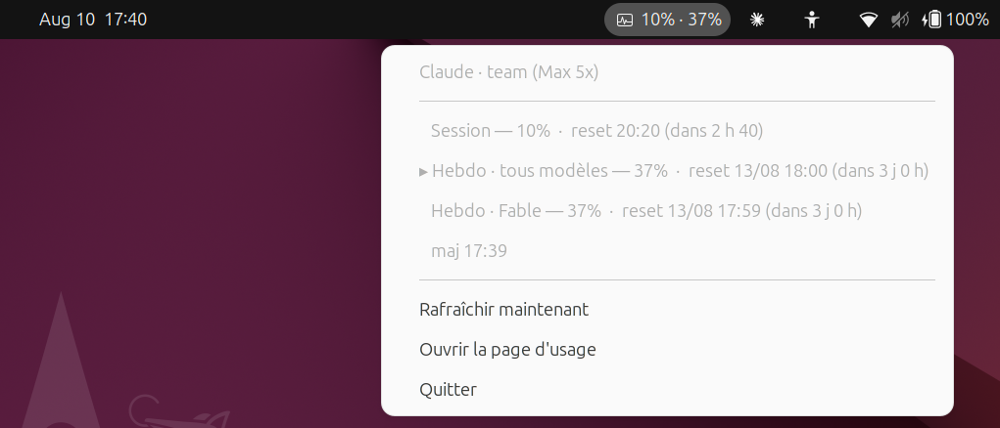

# ubuntu-claude-monitor

Indicateur permanent dans la barre système Ubuntu affichant tes limites d'usage
Claude — les mêmes pourcentages que `claude /usage` et que la page
[claude.ai/settings/usage](https://claude.ai/settings/usage).



Le label `10% · 37%` reste visible en permanence dans la barre ; le menu donne le
détail par limite avec l'heure de reset et le temps restant.

Autonome : stdlib Python uniquement (`urllib`, pas de `requests`), plus
PyGObject pour l'icône. Ni `ccusage`, ni `claude-monitor`, ni parsing des logs
locaux — la donnée vient directement de l'API.

## Installation

```bash
./install.sh
```

Le script installe `gir1.2-ayatanaappindicator3-0.1` si besoin, vérifie l'accès
API, puis enregistre un service utilisateur systemd démarré automatiquement avec
la session graphique.

Prérequis : Claude Code connecté (`claude` au moins une fois), GNOME avec
l'extension `ubuntu-appindicators` activée (fournie par défaut sur Ubuntu).

## Usage en ligne de commande

```bash
./claude_usage_monitor.py --once      # affichage texte avec barres, puis quitte
./claude_usage_monitor.py --json      # état normalisé en JSON
./claude_usage_monitor.py --raw       # réponse brute de l'API
./claude_usage_monitor.py --watch 60  # rafraîchissement en terminal
./claude_usage_monitor.py             # indicateur (mode par défaut)
```

## Configuration

Optionnelle, dans `~/.config/ubuntu-claude-monitor/config.toml` :

```toml
interval_seconds = 120                  # période de poll, plancher forcé à 60 s
min_fetch_interval = 20                 # délai mini entre deux requêtes (anti-429)
thresholds = [80, 95]                   # seuils de notification (%)
label_format = "{session}% · {weekly}%" # texte affiché dans la barre
show_scoped = true                      # afficher les limites par modèle (Fable, Opus…)
show_inactive = true                     # afficher les limites non actives
notifications = true
http_timeout = 15
max_backoff_seconds = 900               # plafond du backoff sur erreur
```

## Fonctionnement

**Source.** `GET https://api.anthropic.com/api/oauth/usage`, avec l'en-tête
`anthropic-beta: oauth-2025-04-20` et le token OAuth local en `Bearer`. C'est
l'endpoint interne que Claude Code utilise pour `/usage` : non documenté, il peut
changer sans préavis. Le champ `limits[]` de la réponse est utilisé en priorité ;
un repli sur les champs bruts (`five_hour`, `seven_day`, `seven_day_opus`…) prend
le relais si cette clé disparaît.

**Token.** Lu dans `~/.claude/.credentials.json`
(`claudeAiOauth.accessToken`), relu à chaque poll. Le fichier est surveillé par
inotify : quand Claude Code rafraîchit le token, l'indicateur le récupère dans
la seconde.

> **Le programme ne rafraîchit jamais le token et n'écrit jamais dans
> `.credentials.json`.** Les refresh tokens rotent côté serveur : en consommer un
> ici invaliderait la copie détenue par Claude Code et te déconnecterait de
> Claude Code. Quand l'access token expire, l'indicateur passe en état dégradé
> (icône hors-ligne + message « lance `claude` ») et attend le rafraîchissement
> fait par Claude Code lui-même.

**Robustesse.** Le fetch tourne dans un thread, l'UI est mise à jour via
`GLib.idle_add`. Sur erreur HTTP/réseau, backoff exponentiel plafonné à
`max_backoff_seconds`. Le dernier état valide est mis en cache dans
`~/.cache/ubuntu-claude-monitor/state.json` et réaffiché au démarrage.

**Changement de compte.** Déconnexion/reconnexion sous un autre compte est prise
en charge sans rien toucher : le token est relu, donc les pourcentages, le type
d'abonnement et le palier de limites (`team (Max 5x)`, `Pro`…) suivent
automatiquement, y compris l'apparition de nouvelles limites (Opus, Sonnet,
Cowork). Le cache est scopé au compte via une empreinte des UUID stockés par
Claude Code dans `~/.claude.json` — les tokens rotent à chaque refresh et ne
peuvent donc pas servir d'identité. Un cache écrit sous un autre login est
ignoré, et une bascule de compte en cours d'exécution vide l'état, les
notifications déjà émises et la pause 429 (le rate limit est par compte).

**Anti-429.** L'endpoint rate-limite assez vite. Trois garde-fous : plancher de
60 s sur `interval_seconds`, délai minimum `min_fetch_interval` entre deux
requêtes quelle qu'en soit l'origine (clics répétés sur « Rafraîchir », rafale
d'écritures sur le fichier de credentials), et respect de l'en-tête
`Retry-After` renvoyé par le serveur — qui l'emporte sur le backoff calculé
quand il demande une pause plus longue. Une pause 429 est persistée en horloge
murale dans le cache, donc un `systemctl restart` ou une reconnexion de session
ne la réarme pas à zéro. Un 429 n'efface pas l'affichage : le dernier état
valide reste visible avec la ligne d'avertissement en dessous.

Chaque cycle écrit une ligne dans le journal (`usage: session X%, hebdo Y%` ou
`fetch échoué (kind): … — nouvel essai dans N s`), donc l'état réel se lit avec
`journalctl --user -u claude-usage-monitor -f`.

**Notifications.** `notify-send` au franchissement de chaque seuil, une seule
fois par fenêtre de limite : la déduplication est indexée sur
`kind:scope:resets_at`, donc le reset d'une fenêtre réarme la notification.

## Tests

```bash
python3 tests/test_stubbed_indicator.py
```

Instancie l'indicateur avec des stubs GTK/AppIndicator : fetch réel, icônes par
sévérité, déduplication des notifications, backoff, état dégradé sans
credentials, token expiré, repli sur les champs bruts, formatage. Aucun serveur
graphique requis, mais une session Claude Code valide oui.

## Dépannage

| Symptôme | Cause probable |
|---|---|
Pas d'icône dans la barre | extension appindicator désactivée → `gnome-extensions enable ubuntu-appindicators@ubuntu.com` |
Icône hors-ligne, « token expiré » | lance `claude` une fois pour rafraîchir |
`HTTP 401` | token révoqué → reconnecte-toi avec `claude` |
`HTTP 429` | trop de polls, augmente `interval_seconds` |
Icône présente, pas de texte | certains thèmes masquent les labels d'indicateur |

Logs : `journalctl --user -u claude-usage-monitor -f`
